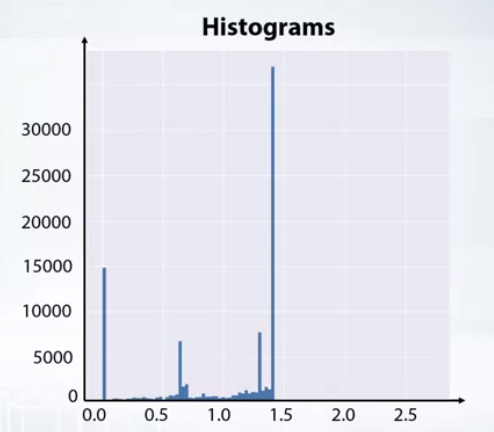

# Notes: Week 2

### 1. Exploratory data analysis (EDA)
- process of familiarizing with the data
- build the intuition about the data
- find insights and generate hypotesizes

#### 1. Visualization
- **histograms** 
    
    - split feature range into bins and shows how many points fall into each bin
    - can be missleading - vary number of bins
    - aggregates the data so we cannot see if the values are uniqe or there is a lot of duplicate data
    - `plt.hist(x)`
- **plot index vs. values**
    - 
